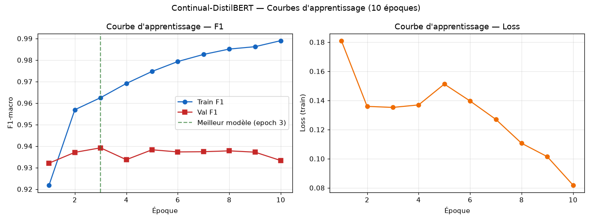
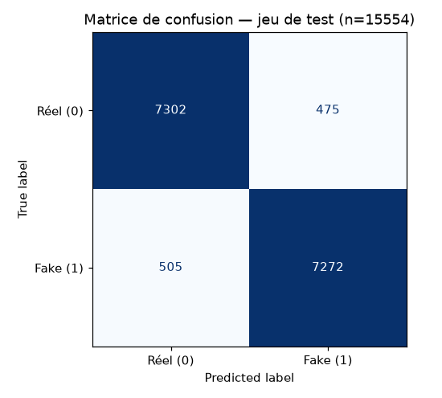
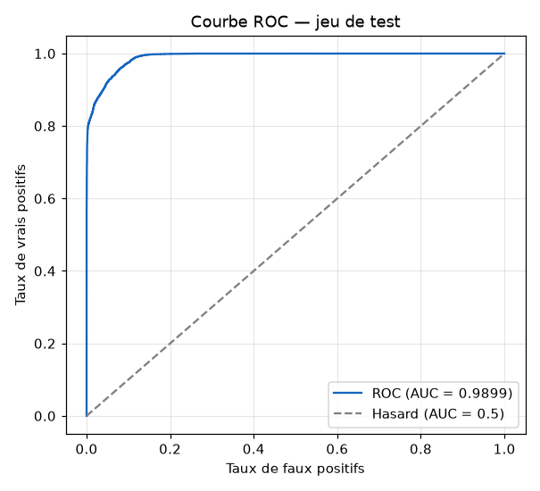
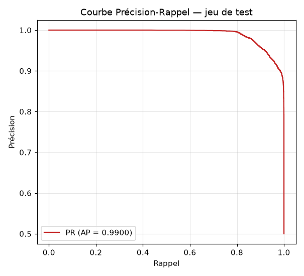
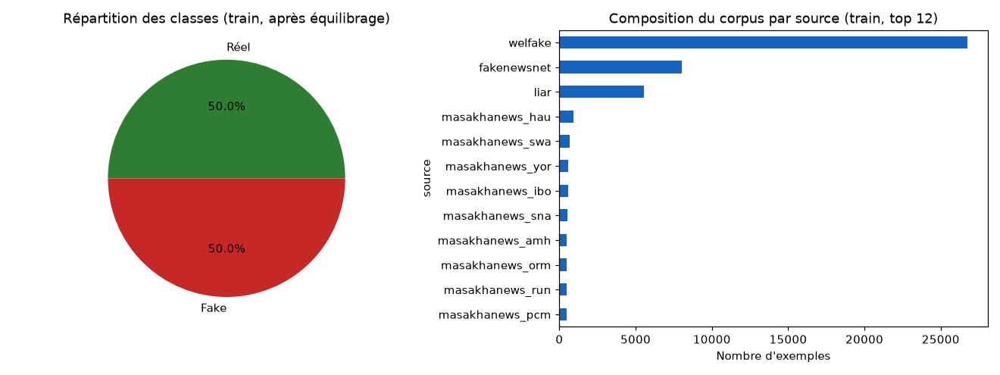
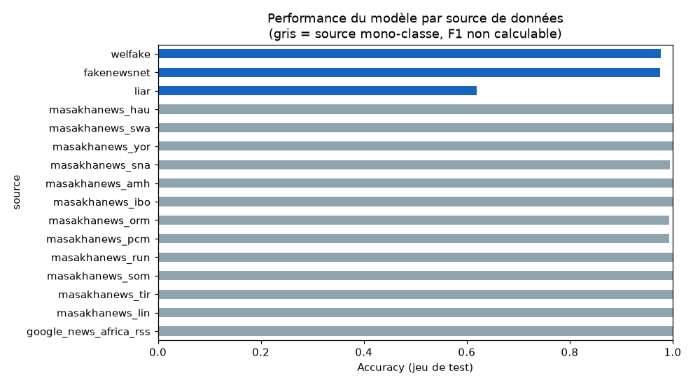
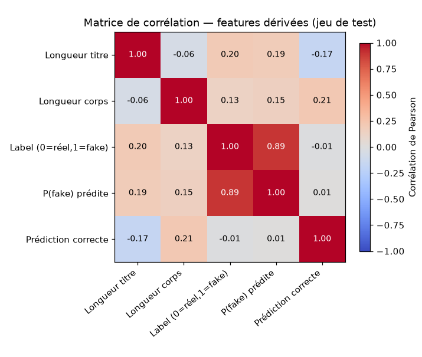
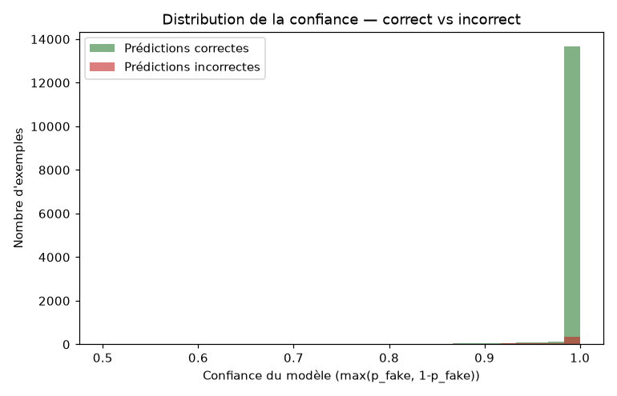

# Rapport d'analyse — Continual-DistilBERT

Généré automatiquement par `scripts/generate_reports.py` le 2026-08-28.

## Résumé des métriques finales (jeu de TEST, jamais vu à l'entraînement)

- **Meilleure époque retenue** : 3 (sélection sur Val F1, jeu de validation)
- **F1-macro (test)** : 0.9370
- **ROC-AUC (test)** : 0.9899
- **Average Precision (test)** : 0.9900
- **Matrice de confusion (test)** : TP=7272, TN=7302, FP=475, FN=505
- **Nombre d'exemples de test** : 15554

>Ces chiffres sont ceux, et uniquement ceux, obtenus par le ré-entraînement réel du 27-28/08/2026 sur cette machine. Voir README.md, section "Incident du 26/08/2026 et reprise", avant de les comparer à ceux déjà rédigés dans le mémoire v7.

## Figures et interprétations

### Courbes d'apprentissage (loss + F1 par époque)

Le Train F1 progresse de manière quasi monotone (0.922 → 0.989) tandis que le Val F1 plafonne dès l'époque 3 (0.9392) puis oscille légèrement à la baisse (épisode 10 : 0.9333). L'écart Train/Val final (0.056) est la signature classique d'un début de sur-apprentissage au-delà de l'époque 3 : le modèle mémorise des motifs propres au corpus d'entraînement sans gain de généralisation. **Le modèle réellement conservé et évalué ci-dessous est celui de l'époque 3** (seule époque où `model.save_pretrained()` s'est déclenché), pas celui de la dernière époque — voir `scripts/train_model.py` (sélection du meilleur checkpoint + early stopping par patience ajouté suite à ce constat).

### Matrice de confusion (jeu de test)

Sur les 15554 exemples du jeu de test (jamais vus pendant l'entraînement ni pour le choix du meilleur checkpoint) : 7272 vrais positifs (fake correctement détecté), 7302 vrais négatifs (réel correctement identifié), 475 faux positifs (réel classé fake à tort) et 505 faux négatifs (fake manqué). Taux de faux positifs : 6.1 % — c'est le risque opérationnel le plus sensible du projet (classer une source fiable comme désinformation), déjà identifié et documenté dans le mémoire comme un défi majeur (biais de classe sur les dépêches officielles).

### Courbe ROC (jeu de test)

AUC = 0.9899 sur le jeu de test : le modèle sépare très bien les deux classes indépendamment du seuil de décision choisi. Une AUC aussi proche de 1 confirme que le F1 macro de 0.9370 n'est pas dû à un seuil de décision chanceux mais à une séparation réelle des distributions de probabilité entre classes.

### Courbe Précision-Rappel (jeu de test)

Average Precision = 0.9900. Complémentaire à la ROC, cette courbe est plus informative sur un cas d'usage où le coût des faux positifs est élevé (ici : signaler à tort une source fiable). La précision reste élevée sur une large plage de rappel, ce qui est rassurant pour un déploiement en production.

### Répartition des classes et composition du corpus

Le corpus d'entraînement est strictement équilibré 50/50 par sous-échantillonnage (voir `scripts/preprocess_data.py`), ce qui évite le biais de classe documenté dans le mémoire (le corpus brut était à ~58,7 % fake). WELFake domine la composition (26728 exemples), suivi de FakeNewsNet et LIAR ; le sous-corpus africain multilingue (MasakhaNEWS + RSS, 12 langues) apporte une diversité linguistique absente des 3 autres datasets, renforcée par le sur-échantillonnage `--africa_boost=5` pendant l'entraînement.

### Performance par source de données (jeu de test)

Seules 3 source(s) contiennent les deux classes dans le jeu de test et permettent un F1 macro pertinent : welfake (F1=0.976, n=8876), fakenewsnet (F1=0.974, n=2671), liar (F1=0.598, n=1867). Le F1 le plus bas revient à **liar** — ses textes très courts et stylistiquement différents (déclarations politiques brutes, sans article complet) expliquent la difficulté relative du modèle. Les 13 sources restantes (tout le sous-corpus africain MasakhaNEWS + RSS) ne contiennent QUE des exemples réels dans ce corpus : leur F1-macro ne serait pas interprétable (dégénère à 1.0 par construction sklearn dès qu'une seule classe est présente), d'où l'usage de l'**accuracy** (barres grises) — accuracy = 0.999 en moyenne sur ces sources, ce qui mesure la capacité du modèle à ne PAS classer à tort ces dépêches africaines comme fake.

### Matrice de corrélation (features dérivées)

Corrélation label / probabilité prédite = 0.89 : forte cohérence entre les prédictions du modèle et la vérité terrain, cohérent avec l'AUC observée. Corrélation longueur du titre / label = 0.20 : les titres fake ont tendance à être plus longs/accrocheurs — une corrélation longueur/label proche de 0 est plutôt rassurante : elle indique que le modèle doit apprendre du contenu sémantique, pas d'un artefact de longueur de texte.

### Distribution de la confiance du modèle

Les prédictions correctes sont concentrées à haute confiance (proche de 1.0), tandis que les erreurs se regroupent davantage près du seuil de décision (0.5-0.7). Cela confirme que la confiance du modèle est un signal exploitable en production : un seuil de confiance minimal (déjà utilisé dans `spark-app/src/nlp_classifier.py`, seuil 0.75 sur p_fake) permet de filtrer une partie des cas ambigus avant apprentissage en ligne.

### Analyse qualitative des erreurs (faux positifs / faux négatifs)

Voir `reports/analyse_erreurs.md` pour les 10 faux positifs et 10 faux négatifs les plus confiants (donc les plus problématiques) du jeu de test, avec titre et source — matière directe pour la section discussion/limites du mémoire.

