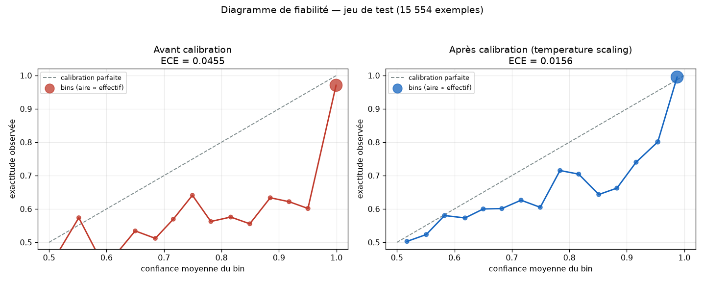
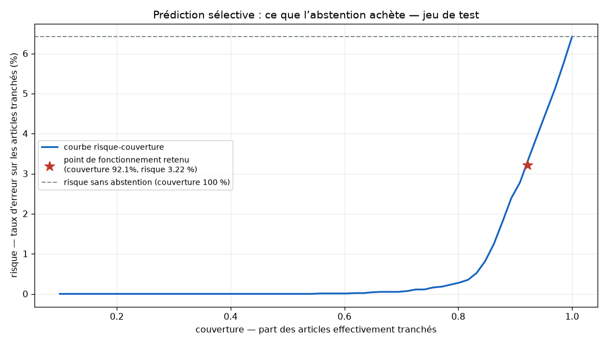

# Calibration probabiliste et prédiction sélective

_Généré par `scripts/calibrate_model.py` le 2026-09-15 (température ajustée sur `data/processed/val/val.csv`, report sur le jeu de test tenu à l'écart, 3535s CPU)._

## 1. Pourquoi

La Figure 4.5 du mémoire montrait un modèle **fortement sur-confiant** : la quasi-totalité des prédictions, justes comme erronées, se logeait au-dessus de 0,95 de confiance, et la Figure 4.7 relevait une corrélation quasi nulle (0,01) entre justesse et probabilité prédite. La confiance affichée ne prédisait donc pas la justesse — ce que le chapitre 4 signalait déjà comme « une amélioration immédiate du dispositif ». C'est cette amélioration qui est implémentée ici.

## 2. Temperature scaling

Température ajustée par maximum de vraisemblance : **T = 3.0554**. La transformation étant monotone, l'ordre des scores et donc l'AUC-ROC (0,9899) sont strictement inchangés ; seule la lecture probabiliste est corrigée.

| Métrique | Validation avant | Validation après | Test avant | Test après |
|---|---|---|---|---|
| ECE (erreur de calibration attendue) | 0.0423 | **0.0127** | 0.0455 | **0.0156** |
| Score de Brier | 0.0507 | **0.0427** | 0.0529 | **0.0440** |
| Log-vraisemblance négative | 0.2573 | **0.1401** | 0.2652 | **0.1427** |

## 3. Prédiction sélective

Seuils calibrés sur la validation pour une précision cible de 97% sur chacune des deux décisions :

- `p_cal >= 0.7109` → **FAKE**
- `p_cal <= 0.25` → **RÉEL**
- entre les deux → **INCERTAIN**, renvoyé à la vérification humaine

| Mesure (jeu de test) | Valeur |
|---|---|
| Couverture (articles tranchés) | **92.12%** |
| Abstention | 7.88% (1225 articles) |
| F1-macro sur la zone tranchée | **0.9678** |
| Risque (erreur) sur la zone tranchée | **3.22%** |
| Précision de la décision « faux » | 0.9713 |
| Précision de la décision « fiable » | 0.9645 |
| F1-macro à couverture 100 % (abstention comptée « réel ») | 0.9240 |
| Référence v2.4 : seuil 0,75 sur probabilité non calibrée | 0.9327 |

## 4. Où le modèle reconnaît sa limite

Taux d'abstention par source sur le jeu de test — la zone grise se concentre exactement là où le chapitre 4 situait la faiblesse du modèle :

| Source | n | Taux d’abstention |
|---|---|---|
| liar | 1867 | 58.28% |
| welfake | 8876 | 1.25% |
| fakenewsnet | 2671 | 0.94% |
| masakhanews_pcm | 143 | 0.70% |
| google_news_africa_rss | 20 | 0.00% |
| masakhanews_amh | 173 | 0.00% |
| masakhanews_hau | 352 | 0.00% |
| masakhanews_ibo | 171 | 0.00% |
| masakhanews_lin | 74 | 0.00% |
| masakhanews_orm | 157 | 0.00% |
| masakhanews_run | 143 | 0.00% |
| masakhanews_sna | 206 | 0.00% |

## 5. Intégration en production

L'artefact `models/calibration.json` est chargé au démarrage par `spark-app/src/nlp_classifier.py` et par le routeur de recherche web de l’API. En son absence, le pipeline retombe exactement sur le comportement antérieur (T = 1, seuil unique 0,75, aucune abstention) : la mise à jour est donc sans risque de régression.

