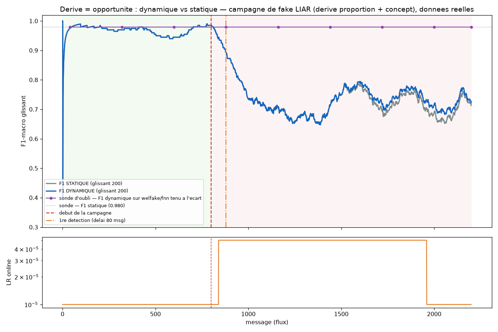

# Experience — la derive comme opportunite d'apprentissage

_Genere par `scripts/experiment_derive_opportunite.py` le 2026-09-15 (seed 0, 2200 messages, 55 MAJ online, 1502s CPU)._

Scenario : une **campagne de desinformation** monte abruptement en puissance a t=800 (la proportion d'articles fake passe de 50 % a 80 %). Les fake de la campagne sont tires du sous-corpus **LIAR** (declarations politiques courtes, terrain faible du modele) : la derive est donc a la fois de **proportion** (vue par le tri-detecteur `drift_monitor.py`, qui fait passer le LR de 1e-5 a 5e-5 automatiquement) et de **concept** (le F1 chute). Protocole prequential (test-then-train, section 3.5.1). Bras dynamique = `spark-app/src/nlp_classifier.py` a l'identique. Articles **reels** (data/processed/test/test.csv) ; seul l'ordre/la proportion sont controles.

| Phase | n | F1-macro STATIQUE | F1-macro DYNAMIQUE |
|---|---|---|---|
| P0 (pre-campagne, welfake/fnn) | 800 | 0.9700 | 0.9700 |
| P1 (debut campagne) | 400 | 0.7116 | 0.7116 |
| P2 (campagne etablie, apres adaptation) | 1000 | 0.7183 | 0.7312 |

- **Tri-detecteur** : a declenche (delai 80 messages apres le debut de la campagne).
- **Gain dynamique vs statique en P2 (campagne etablie)** : **+1.29 points de F1-macro**.
- **Recuperation du modele dynamique en P2 par rapport a P0** : -23.88 points.
- **Oubli catastrophique** (sonde welfake/fnn tenue a l'ecart) : F1 statique 0.9797 -> F1 dynamique fin 0.9797 (**+0.00 pts** ; positif = oubli).
- Paradigme "derive = opportunite" verifie ? **NON** (F1 dyn. P2 > F1 statique P2 et F1 dyn. P2 >= F1 dyn. P0 - 2 pts).

