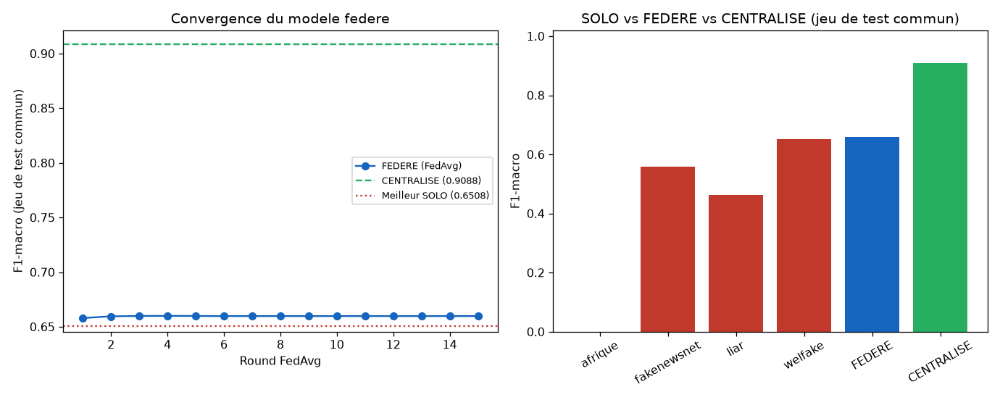

# Preuve de concept — Federated Learning inter-organisations (Recommandation 3)

_Genere par `scripts/experiment_federated_simulation.py` le 2026-09-15 (15 rounds FedAvg, 109s CPU)._

Repond a la Recommandation 3 du memoire (Chapitre 5, §5.5) par une preuve de concept reelle et executable, a defaut de federer Continual-DistilBERT lui-meme (hors de portee CPU). 4 organisations simulees par partition du corpus par source ; **aucune donnee brute ne quitte une organisation** — seuls les poids du modele local sont moyennes (FedAvg, McMahan et al. 2017), exactement comme le ferait une federation reelle.

| Regime | n | F1-macro (jeu de test commun) |
|---|---|---|
| SOLO — org_afrique | 6370 | N/A — corpus mono-classe (label=0 uniquement) — entrainement solo impossible |
| SOLO — org_fakenewsnet | 8036 | 0.5582 |
| SOLO — org_liar | 5526 | 0.4637 |
| SOLO — org_welfake | 26728 | 0.6508 |
| **FEDERE (FedAvg, 15 rounds)** | 46660 (jamais poole) | **0.6598** |
| CENTRALISE (upper bound theorique) | 46660 (poole) | 0.9088 |

- **Gain du régime fédéré vs meilleur régime solo** : +0.0090 point de F1-macro, sans qu'aucune organisation ne partage ses données brutes — et surtout, `org_afrique` (mono-classe) ne peut tout simplement pas entraîner de détecteur seule : la fédération est la seule façon pour elle de bénéficier d'un modèle fonctionnel sans exposer ses données.
- **Écart au majorant centralisé** : +0.2490 point. Cet écart important est cohérent avec la littérature FedAvg (McMahan et al. 2017) : le partitionnement par source ici est fortement **non-IID** (registres textuels très différents — dépêches WELFake, déclarations politiques LIAR, presse africaine 100 % réelle) et une simple moyenne pondérée des poids locaux converge mal dans ce régime, phénomène documenté et toujours actif en recherche (FedProx, SCAFFOLD, et d'autres variantes visent précisément à corriger cette limite de FedAvg vanilla).

## Limites de cette preuve de concept

- Modèle plus léger (HashingVectorizer + régression logistique SGD) que Continual-DistilBERT, choisi pour rester exécutable en quelques minutes sur CPU sans infrastructure réseau réelle.
- Simulation en un seul processus (4 "organisations" = 4 partitions en mémoire) : aucune vraie communication réseau, aucun chiffrement, aucune gestion de la latence/panne d'un participant — tout cela relève d'une implémentation production (ex. Flower, TensorFlow Federated).
- Le partitionnement par source est un simplificateur pédagogique ; une vraie fédération inter-organisations poserait aussi des questions de format de données et de gouvernance non traitées ici.
