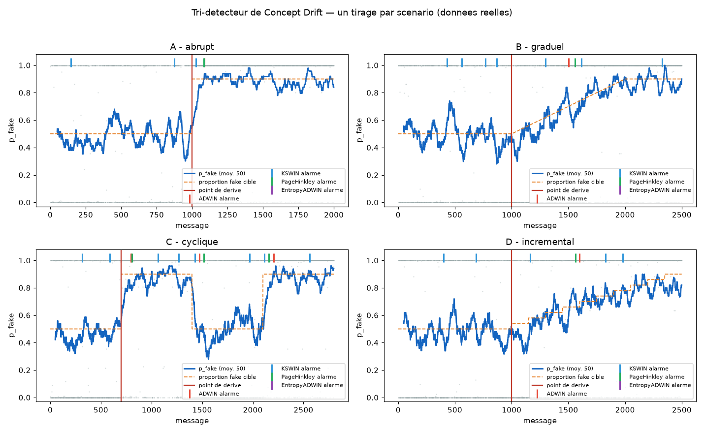

# Tableau 4.3 — Performances du tri-detecteur de Concept Drift

_Genere par `scripts/experiment_tri_detecteur.py` le 2026-09-15 — 30 repetitions par scenario, pool de 1600 articles reels/classe (welfake + fakenewsnet)._

Signal surveille : `p_fake` du modele Continual-DistilBERT sur des articles **reels** du jeu de test. La derive = variation de la proportion d'articles fake dans le flux (calque sur `scripts/inject_drift_simulation.py` et la section 3.4.3). Detection comptee si une alarme survient dans les 500 messages suivant le point de derive ; faux positif = alarme dans la zone stationnaire. Parametres identiques a `spark-app/src/drift_monitor.py` (ADWIN δ=0.002, KSWIN α=0.005 fenetre 100, PageHinkley δ=0.005 λ=50.0, EntropyADWIN δ=0.002, composite seuil 0.4, poids {'ADWIN': 0.45, 'KSWIN': 0.35, 'PageHinkley': 0.2}, remanence 100). River 0.26.1.

| Scenario | Detecteur | Delai moyen (msg) | Delai median | TPR | FPR | n detect. |
|---|---|---|---|---|---|---|
| A - abrupt | ADWIN | 80 | 87 | 1.00 | 0.00 | 30/30 |
| A - abrupt | KSWIN | 24 | 24 | 0.93 | 0.77 | 28/30 |
| A - abrupt | PageHinkley | 109 | 112 | 1.00 | 0.00 | 30/30 |
| A - abrupt | EntropyADWIN | - | - | 0.00 | 0.00 | 0/30 |
| A - abrupt | Composite | 79 | 87 | 1.00 | 0.00 | 30/30 |
| B - graduel | ADWIN | 433 | 439 | 0.17 | 0.00 | 5/30 |
| B - graduel | KSWIN | 261 | 246 | 0.67 | 0.90 | 20/30 |
| B - graduel | PageHinkley | 412 | 422 | 0.47 | 0.00 | 14/30 |
| B - graduel | EntropyADWIN | - | - | 0.00 | 0.00 | 0/30 |
| B - graduel | Composite | 422 | 420 | 0.27 | 0.00 | 8/30 |
| C - cyclique | ADWIN | 87 | 99 | 1.00 | 0.00 | 30/30 |
| C - cyclique | KSWIN | 37 | 27 | 1.00 | 0.73 | 30/30 |
| C - cyclique | PageHinkley | 119 | 122 | 1.00 | 0.00 | 30/30 |
| C - cyclique | EntropyADWIN | - | - | 0.00 | 0.00 | 0/30 |
| C - cyclique | Composite | 86 | 84 | 1.00 | 0.00 | 30/30 |
| D - incremental | ADWIN | 391 | 391 | 0.07 | 0.00 | 2/30 |
| D - incremental | KSWIN | 248 | 288 | 0.57 | 0.90 | 17/30 |
| D - incremental | PageHinkley | 408 | 426 | 0.33 | 0.00 | 10/30 |
| D - incremental | EntropyADWIN | - | - | 0.00 | 0.00 | 0/30 |
| D - incremental | Composite | 396 | 402 | 0.13 | 0.00 | 4/30 |

## Lecture

- **Delai moyen** : nombre de messages entre le point de derive reel et la premiere alarme du detecteur (sur les repetitions ou il a detecte).
- **TPR** : fraction des repetitions ou le detecteur a signale la derive dans la fenetre de 500 messages.
- **FPR** : fraction des repetitions avec au moins une fausse alarme avant la derive (zone stationnaire).
- Le **score composite** (0.45·ADWIN + 0.35·KSWIN + 0.2·PageHinkley, remanence de 100 messages, seuil 0.4), complete par **EntropyADWIN en OU logique** (canal independant, n'entre pas dans la ponderation — une premiere version ponderee degradait le TPR des scenarios B/D, cf. drift_monitor.py), est la strategie reellement utilisee en production (spark-app/src/drift_monitor.py).
